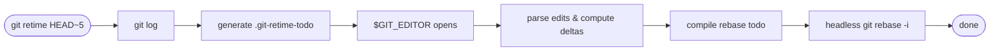

# git-retime

The missing interactive time editor for Git. Edit commit timestamps using a clean, data-centric interface.

`git-retime` opens your editor with a structured todo file where you can shift, randomize, or rewrite commit timestamps using a concise syntax, then applies the changes via a headless `git rebase -i`.

## Install

**macOS / Linux:**

```bash
curl -fsSL https://raw.githubusercontent.com/erfnzdeh/git-retime/main/install/install.sh | bash
```

**Windows (PowerShell):**

```powershell
iwr -useb https://raw.githubusercontent.com/erfnzdeh/git-retime/main/install/install.ps1 | iex
```

**From source:**

```bash
go install github.com/erfnzdeh/git-retime@latest
```

## Usage

```bash
git retime HEAD~5   # Open editor for the last 5 commits
git retime abc1234  # Retime from abc1234 to HEAD
```

Running `git retime HEAD~5` opens your editor with a file like this:

```
# Retime 5 commits onto abc1234
#
a1b2c3d  2026-02-23 10:00:00  Fix navbar
f012345  2026-02-23 10:30:00  Create user models
c5d6e7f  2026-02-23 11:00:00  Add API endpoints
8901abc  2026-02-23 11:45:00  Write tests
e5f6a7b  2026-02-23 12:15:00  Update README
```

Edit the middle column, save, and the timestamps are rewritten. For example:

```
# Retime 5 commits onto abc1234
#
a1b2c3d  2026-02-23 14:00:00       Fix navbar          # absolute: exact time
f012345  2026-02-23 10:30:00 +2h   Create user models  # shift from the written time
c5d6e7f  +1h30m                    Add API endpoints   # previous commit's new time + 1h30m
8901abc  +45m                      Write tests         # previous commit's new time + 45m
e5f6a7b  RR(09,17):RR:00          Update README       # random hour in 9-17, random minute
```

Other supported values: `NOW` (current wall-clock time), `RR:RR:00` (random hour 0-23, random minute 0-59). `RR` accepts an optional range — `RR(09,17)` restricts the random value to between 9 and 17. Units: `w` weeks, `d` days, `h` hours, `m` minutes, `s` seconds. `RR` only works in time fields, not date fields.

> **Columns are separated by two or more spaces.** A trailing shift like `+3d` is part of the timestamp column, so there must be at least two spaces between it and the commit message. Writing `2026-02-17 03:55:33 +3d  My message` (two spaces before the message) is correct; a single space will cause a parse error.

## Editing Commit Messages

The last column is the commit message subject. Editing it will rewrite the commit message (the body is preserved).

## Time Paradox Detection

If an edited timestamp creates a child commit older than its parent, `git-retime` warns you and asks whether to proceed.

When using `--randomize`, times are automatically sorted within each day so commits on the same date stay in order. Commits on different dates are not compared — a later commit on an earlier date is intentional and allowed. Pass `--randomize-allow-paradox` to disable this sorting and let each commit get a fully independent random time.

```
warning: time paradox detected
  f012345 (2026-02-23 09:00:00) is older than a1b2c3d (2026-02-23 10:00:00)
Proceed anyway? [y/N]
```

## Flags

The `--shift` and `--randomize` flags let you retime commits non-interactively — no editor is opened, the change is applied immediately:

```bash
git retime HEAD~3 --shift +2h                  # Shift last 3 commits by 2 hours
git retime HEAD~5 --randomize 09:00-17:00      # Randomize time-of-day within working hours
```

| Flag | Description |
|------|-------------|
| `--shift +2h` | Shift all commits by an offset |
| `--randomize 09:00-17:00` | Randomize time-of-day within a range |
| `--randomize-allow-paradox` | Skip monotonic ordering within each day when randomizing |
| `--split-dates` | Edit author and committer dates independently (two timestamp columns) |
| `-i` | Accepted for compatibility (interactive is the default) |

## Aborting

To abort a retime session, either:
- Delete all lines in the editor
- Write `ABORT` on the first line

## How It Works



1. Fetches commits via `git log`
2. Generates a `.git-retime-todo` file with timestamps in your local timezone
3. Opens your `$GIT_EDITOR`
4. Parses edits, computes deltas, and applies them to the original timestamps
5. Compiles a `git rebase -i` todo with `pick` + `exec` lines that amend each commit's dates
6. Executes a headless rebase via `GIT_SEQUENCE_EDITOR`

The headless rebase works by setting `GIT_SEQUENCE_EDITOR` to a `cp` command that replaces Git's auto-generated todo with the pre-compiled one:

```bash
GIT_SEQUENCE_EDITOR="cp /path/to/compiled-todo" git rebase -i --rebase-merges <base>
```

The compiled todo contains `pick` + `exec` pairs. The `exec` line uses `--date` to set the author date and `GIT_COMMITTER_DATE` for the committer date:

```
pick a1b2c3d Fix navbar
exec GIT_COMMITTER_DATE="2026-02-23T10:00:00+0500" git commit --amend --no-edit --allow-empty --date="2026-02-23T10:00:00+0500"
```

If the commit message was edited, `--no-edit` is replaced with `-m 'New subject'` and the original body is preserved. If the rebase fails for any reason, `git-retime` automatically runs `git rebase --abort` to restore your repository.

### Timezone Strategy

Timestamps are displayed in your local timezone without showing the offset. Edits are computed as deltas from the displayed time, then applied to the original timestamp in its original timezone. This means you see and edit in local time, but the original timezone offset is preserved in the final commit.

For example, if a commit was authored at `10:00 +0530` (India) and your machine is in `UTC-0800` (LA), you see it as `20:30` in the editor. If you change it to `22:30`, the tool computes a +2h delta and applies it to the original, producing `12:00 +0530` — the offset stays intact.

### Author Date vs. Committer Date

Both are set identically by default. The `--split-dates` flag adds a second timestamp column so you can control them independently.

### Bare Shifts Are Cascading

A bare shift like `+1h` resolves relative to the **previous commit's new (resolved) time**, not the original. This means shifts chain naturally: if commit A is moved to 10:00 and commit B has `+30m`, B lands at 10:30 — and if C has `+15m`, C lands at 10:45 — regardless of where A, B, or C originally were.

A bare shift on the **first commit** is an error; use an absolute timestamp instead.

### NOW Is Exact

All commits using `NOW` receive the exact same timestamp (captured once at execution start). There are no micro-offsets or ordering tricks.

### Scope Is Strictly Timestamps and Messages

You cannot delete or reorder lines. If lines are missing or reordered, the tool refuses and tells you why. This keeps the scope tight and prevents accidental history destruction.

### Merge Topology

Rebase uses `--rebase-merges` to preserve merge commit structure. Standard `git rebase -i` silently drops merge commits and linearizes the graph; `git-retime` avoids this.

### Root Commit Support

When the target revision is the root commit (no parent), the tool automatically uses `--root` so the entire history including the first commit can be retimed.

### Editor Resolution

Resolved via `git var GIT_EDITOR`, which follows Git's own precedence chain: `GIT_EDITOR` env var, then `core.editor` config, then `VISUAL`, then `EDITOR`, then `vi`.

### Revision Input

Accepts anything `git rev-parse` understands: `HEAD~5`, commit hashes, branch names, tags, `@{upstream}`, etc.

## Community

- [Contributing](CONTRIBUTING.md) — How to contribute
- [Code of Conduct](CODE_OF_CONDUCT.md) — Community standards
- [Support](SUPPORT.md) — Where to get help
- [Security](.github/SECURITY.md) — Reporting vulnerabilities

## License

GPL-3.0 — see [LICENSE](LICENSE) for details.
